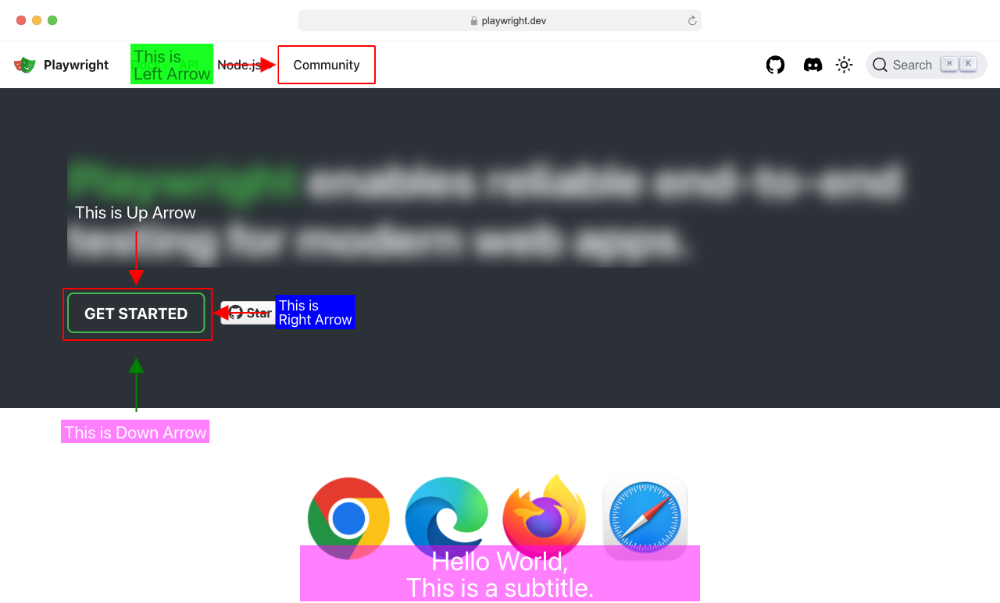

# Playwright Webshot

Easily enhance your webpage screenshots with bounding boxes, arrows, blur masks, text annotations, and browser mockup frames. Keep your documentation visuals up to date effortlessly, reducing the effort required to maintain your screenshots as the UI updates.

[](https://www.npmjs.com/package/playwright-webshot)




## Installation
```bash
npm i playwright-webshot
```

## Usage

Add borders, arrows and mask to target elements on a webpage.

```javascript
// test.ts 
import { test, expect } from "@playwright/test";
import { webshot } from "playwright-webshot";


test("Paint Webshot", async ({ page }) => {
  await page.goto("https://playwright.dev");

  const locator = page.getByText(/get started/i).first();

const screenshot = await webshot(
    page,
    [
      {
        locator,
        type: "box",
        box: {
          border: {
            width: 2,
            color: "red",
          },
          padding: 8,
          radius: 2,
        },
      },
      {
        locator,
        type: "arrow",
        arrow: {
          direction: "down",
          color: "green",
          width: 50,
          height: 2,
          offset: 50,
          text: "This is Down Arrow",
          fontSize: 22,
          textColor: "white",
          textBgColor: "rgba(255,0,255,0.5)",
        },
      },
      {
        locator,
        type: "arrow",
        arrow: {
          direction: "right",
          color: "red",
          width: 50,
          height: 2,
          offset: 30,
          text: "This is <br/> Right Arrow",
          fontSize: 18,
          textColor: "white",
          textBgColor: "blue",
        },
      },
      {
        locator: page.getByText(/Community/i).first(),
        type: "arrow",
        arrow: {
          direction: "left",
          color: "red",
          width: 50,
          height: 2,
          offset: 30,
          text: "This is <br/> Left Arrow",
          fontSize: 22,
          textColor: "rgba(0,0,10,0.5)",
          textBgColor: "rgba(0,255,10,0.9)",
        },
      },
      {
        locator,
        type: "arrow",
        arrow: {
          direction: "up",
          color: "red",
          width: 50,
          height: 2,
          offset: 30,
          text: "This is Up Arrow",
          fontSize: 22,
          textColor: "white",
        },
      },
      {
        locator: page
          .getByText(
            /Playwright enables reliable end-to-end testing for modern web apps./i
          )
          .first(),
        type: "mask",
        mask: {
          color: "transparent",
          blur: 10,
        },
      },
      {
        locator,
        type: "text",
        text: {
          content: "Hello World, <br/> This is a subtitle.",
          color: "white",
          fontSize: 34,
          backgroundColor: "rgba(255,0,255,0.5)",
          bottom: "2px",
          left: "30%",
          right: "30%",
        },
      },
      {
        locator: page.getByText(/Community/i).first(),
        type: "box",
        box: {
          border: {
            width: 2,
            color: "red",
          },
          padding: 8,
          radius: 2,
        },
      },
    ],
    {
      path: "test/screenshot.png",
      showBrowserFrame: true,
      darkMode: false,
    }
  );
  
  await page.close();
});

```

```bash
npx playwright test test.ts
```

#### Contributions are welcome! 🎉

## License
MIT


## Contact me
- [Twitter](https://twitter.com/int2float)
- [Email](mailto:mail2paras.s@gmail.com)
